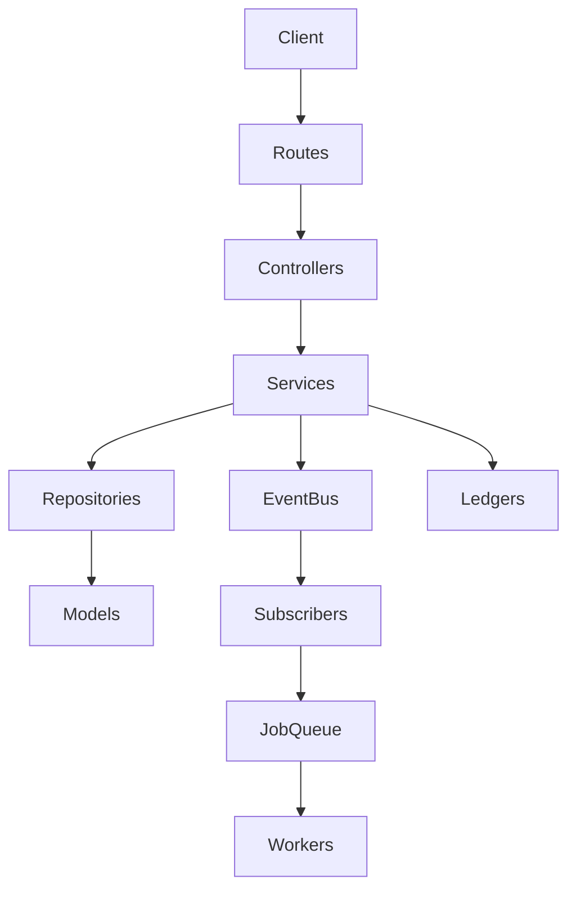

# Architecture

The backend follows Express route handlers, controllers, services, repositories, Mongoose models, event subscribers, and workers.

Dependency flow:

Controllers orchestrate HTTP requests. Payment, inventory, invoice, notification, shipping, analytics, and admin business rules live in services. Repositories own database access. Ledgers are append-only audit history. The event bus decouples side effects from request lifecycles.

Design patterns present:

- Repository Pattern for data access.
- Service Layer for business rules.
- Bridge Service for order/payment/inventory compatibility.
- Adapter Pattern for QR, notification channels, PDF, and courier integrations.
- Append-only Ledger for financial and operational auditability.
