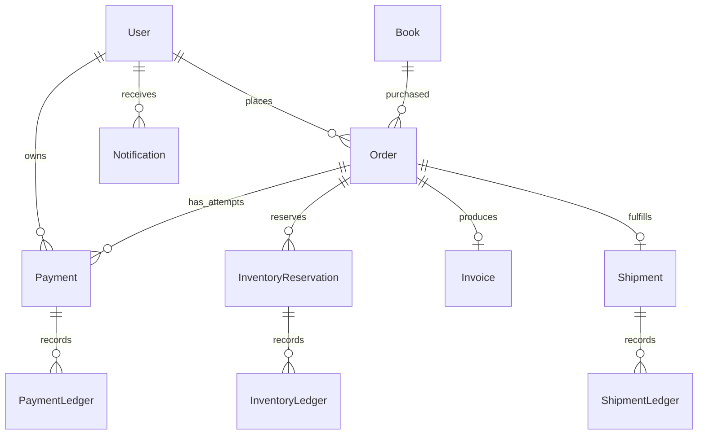

# Database Documentation

Collections documented: 17

- `analyticsevents`
- `books`
- `categories`
- `counters`
- `inventoryledgers`
- `inventoryreservations`
- `invoices`
- `notifications`
- `orders`
- `payments`
- `paymentledgers`
- `publishpackages`
- `publishrequests`
- `reviews`
- `shipments`
- `shipmentledgers`
- `users`

Primary relationships:

- User -> Orders, Payments, Notifications, Shipments, Analytics events.
- Order -> Payment attempts, Inventory reservations, Invoice, Shipment.
- Payment -> PaymentLedger entries and Invoice.
- InventoryReservation -> InventoryLedger entries.
- Shipment -> ShipmentLedger entries.

Transactions are used by payment, inventory, invoice, order bridge, and shipping service paths where atomic writes are required.

