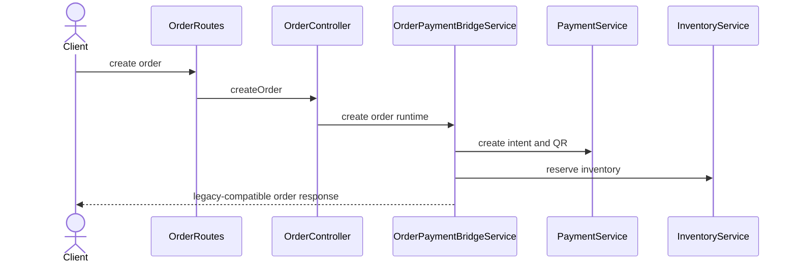

# Order Sequence

```mermaid
sequenceDiagram
  actor Client
  Client->>OrderRoutes: create order
  OrderRoutes->>OrderController: createOrder
  OrderController->>OrderPaymentBridgeService: create order runtime
  OrderPaymentBridgeService->>PaymentService: create intent and QR
  OrderPaymentBridgeService->>InventoryService: reserve inventory
  OrderPaymentBridgeService-->>Client: legacy-compatible order response
```
