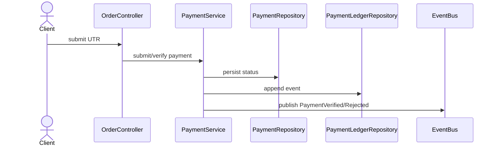

# Payment Sequence

```mermaid
sequenceDiagram
  actor Client
  Client->>OrderController: submit UTR
  OrderController->>PaymentService: submit/verify payment
  PaymentService->>PaymentRepository: persist status
  PaymentService->>PaymentLedgerRepository: append event
  PaymentService->>EventBus: publish PaymentVerified/Rejected
```
